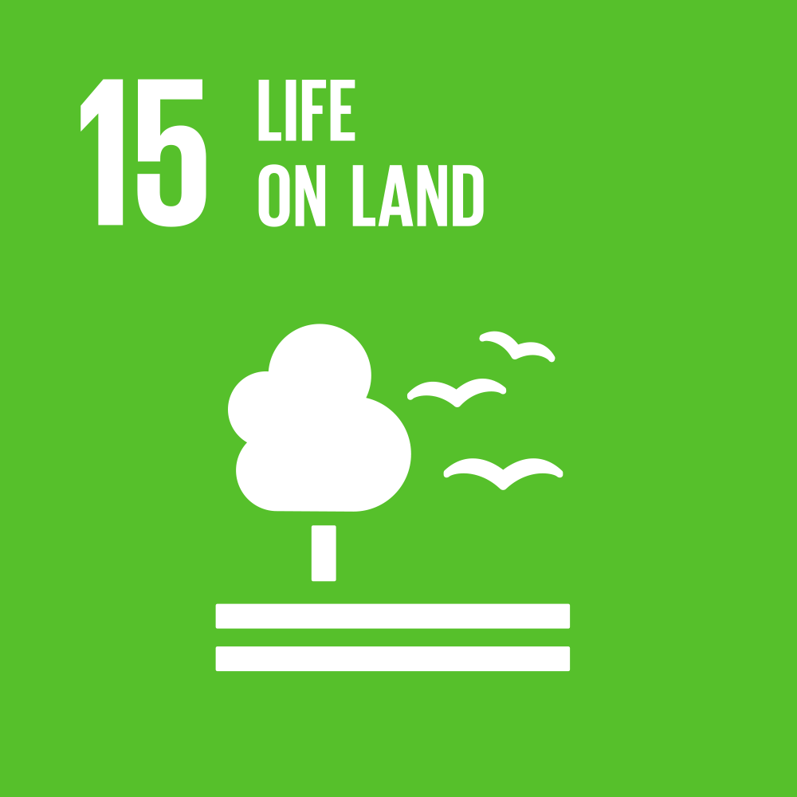

> Activar modo oscuro, por favor...

  

<table border="0" width="100%">
  <tr style="border: none;">
    <td style="border: none;" width="80%">
      <h3 style="margin: 0;">Carrera de Ingeniería Ambiental / Informática / Industrial</h3>
      
<strong>Universidad Peruana Cayetano Heredia</strong>

    </td>
    <td align="right" style="border: none;">
      
    </td>
  </tr>
</table>

---
